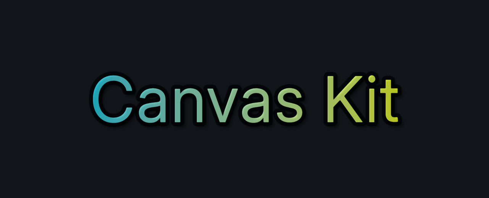
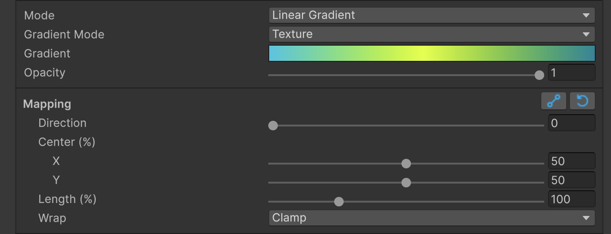
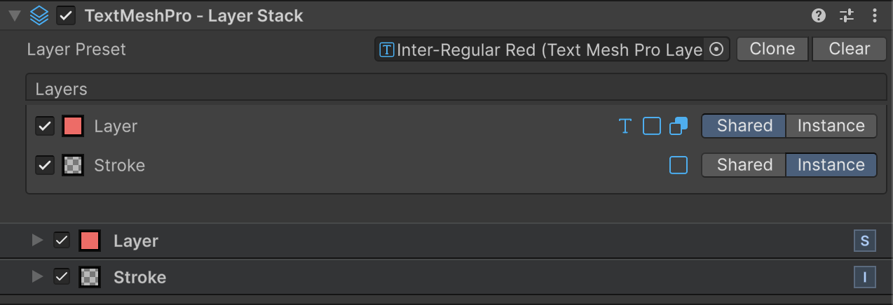
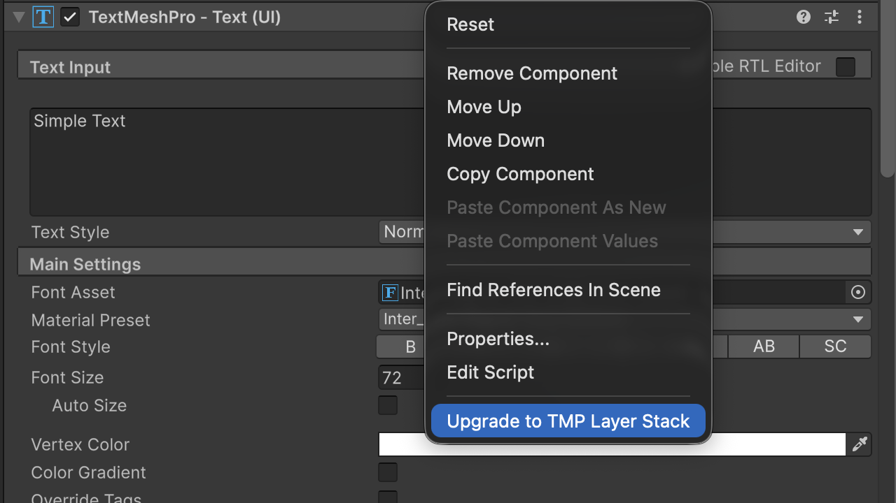
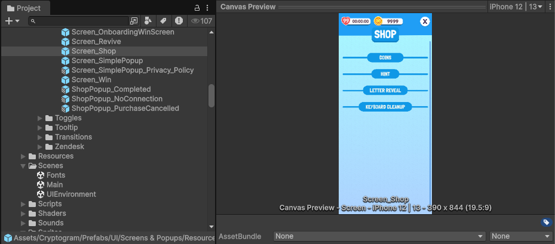

# Canvas Kit

Canvas Kit is an experimental Unity package for authoring UGUI TextMeshPro styles directly in the editor. It provides layer stacks, reusable preset assets, solid and gradient paints, texture paints, blend modes, and upgrade tools for existing TextMeshPro text.

<p align="center">

</p>

## Installation

Canvas Kit is distributed as a Unity Package Manager Git package. Install a released version by adding the package Git URL and tag to your Unity project's `Packages/manifest.json`:

```json
{
  "dependencies": {
    "com.tripledot.canvaskit": "https://github.com/robertcarone-dev/com.tripledot.canvaskit.git#v0.4.3-preview"
  }
}
```

The package manifest is at the repository root, so the URL does not need a `?path=` query. Pinning a tag keeps project installs deterministic; update the tag when moving to a newer release.

Release tags use the package version with a leading `v`, for example `v0.4.3-preview` for package version `0.4.3-preview`.

# Table of Contents

- [Installation](#installation)
- [Features](#features)
  - [TextMeshPro Layer Stack](#textmeshpro-layer-stack)
    - [Getting Started](#getting-started)
    - [Layer Presets](#layer-presets)
    - [Paint and Gradient Controls](#paint-and-gradient-controls)
    - [SDF Fonts and Padding](#sdf-fonts-and-padding)
    - [Shape Slider Limits](#shape-slider-limits)
    - [Preset Sharing and Instance Editing](#preset-sharing-and-instance-editing)
    - [Upgrading Existing Text](#upgrading-existing-text)
    - [Performance](#performance)
    - [Limitations](#limitations)
  - [Canvas Prefab Preview](#canvas-prefab-preview)
  - [Canvas Shader Graph Blend Modes](#canvas-shader-graph-blend-modes)

## Features

### TextMeshPro Layer Stack

The TextMeshPro Layer Stack lets artists and technical artists build text styles from editable visual layers instead of maintaining many material variants.

Each visual layer can include:

- Layer opacity and blend mode
- Fill color, gradient, or texture
- Stroke width, softness, placement, and color
- Shadow offset, spread, blur, and color

When a text object has no configured visual layers, it renders like normal TextMeshPro. Once layers are added, the styled text renders through the Canvas using the layer setup shown in the Inspector.

#### Getting Started

The TextMeshPro Layer Stack is designed for editor-first text styling. A typical workflow is:

1. Create or select a TextMeshPro text object in a Canvas
2. Add the Layer Stack component from the "UI (Canvas)/TextMeshPro - Layer Stack" menu
3. Add one or more visual layers in the Inspector
4. Configure face, outline, shadow, glow, opacity, blend, and paint controls
5. Save reusable styles as Layer Stack Preset assets
6. Preview preset assets to scan the text styles available in the project

Presets can also be dragged into the Scene view or Hierarchy to create styled text quickly.


#### Layer Presets

Layer Stack Presets are reusable text appearances. Create one from "Assets/Create/TextMeshPro/Layer Stack Preset", or save the current layer stack from a selected text object.

Preset assets support Inspector and Project preview rendering. These previews make it faster to see which font styles already exist in the project, compare available looks, and keep text styling easier to manage across UI screens.

Preset controls include:

- Preview text shown in the asset preview
- TMP font asset used while authoring the preset
- Ordered layer list
- Per-layer face, stroke, shadow, glow, blend, opacity, and paint settings

The Inspector also provides pre-configured layer presets to speed up common styling tasks:

| Preset | Starting point |
|:--|:--|
| Fill | A layer focused on the text face |
| Stroke | A layer focused on outline styling |
| Shadow | A layer focused on offset shadow styling |
| Glow | A layer focused on soft additive glow styling |

These options are starting configurations for layers. They are not separate rendering systems, and a layer can still combine multiple visual effects when that is useful.


#### Paint and Gradient Controls

Faces, strokes, shadows, and glows use the same paint controls. Depending on the selected mode, the Inspector shows only the controls that apply.



Available paint modes:

| Mode | Use |
|:--|:--|
| Solid | One color with opacity |
| Linear Gradient | A directional blend across the text bounds |
| Radial Gradient | A center-out blend across the text bounds |
| Texture | Image-based styling with transform controls |

Gradient and texture mapping controls include center, offset, scale, rotation, and wrap behavior. Linear and radial gradients can also be adjusted with Scene view handles when visual placement is easier than numeric editing.


Gradient asset paint and full-gradient paint are uploaded into a runtime `Gradient Atlas` texture for shader sampling. Texture paint samples the assigned image directly.

#### SDF Fonts and Padding

TextMeshPro styling is limited by the active TMP SDF font asset and its atlas padding. Atlas padding defines how much signed-distance-field range exists around each glyph for effects that expand, soften, or offset the text shape.

The layer stack reserves a small sampling guard before calculating usable padding. The remaining SDF budget is shared by face dilate, stroke width and feather, and shadow or glow spread and blur.

Shape values are stored and evaluated in pixels. The Inspector can show percentage-based controls for conversion against the available SDF padding, but pixel values remain the source of truth so matching references from tools such as Figma is straightforward.

Low atlas padding can clamp large effects or prevent them from rendering cleanly. If a style needs wide outlines, soft edges, large shadows, or strong glows, increase the TMP font asset padding and sampling point size for those effects.

#### Shape Slider Limits

The Layer Stack Inspector clamps shape sliders to the SDF range available from the current font and material. The clamp changes as active effect widths change.

The budget is applied as follows:

- Face dilate reserves positive SDF budget first
- Stroke width uses the remaining budget and accounts for stroke position
- Stroke feather uses what remains after the effective stroke width
- Shadow and glow spread can move inward or outward
- Shadow and glow blur uses the remaining outward budget after spread

These limits keep the Inspector from accepting values that the current font padding cannot render correctly. If a slider will not move far enough, the font asset usually needs more SDF atlas padding or the layer needs narrower combined effects.

#### Preset Sharing and Instance Editing

When a text object uses a shared preset, each row can stay linked to the preset or become an object-specific instance.

| Mode | Editing target | Use |
|:--|:--|:--|
| Shared | The shared preset asset | Reusable team styles |
| Instance | Only the selected text object | Local adjustments and animation |

Use Shared mode when many text objects should follow the same style. Edits made in Shared mode update the preset asset and all linked text objects that use that row.

Use Instance mode when one text object needs its own layer values while still starting from the preset. Instance mode is desirable when animating style properties because animation should target the selected object rather than the shared preset asset.

Inspector actions:

- Save turns the current local layers into a reusable preset
- Clone copies the current effective appearance into a new preset
- Clear removes the assigned preset from the selected object
- Apply Font appears when the selected text does not match the preset font



#### Upgrading Existing Text

Existing TextMeshPro styling can be converted into Canvas Kit layer stacks from Unity menus.

Available actions:

- "Upgrade to TMP Layer Stack" from the TextMeshPro component context menu
- "GameObject/UI (Canvas)/TextMeshPro - Upgrade To Layer Stack" for selected text objects
- "Assets/TextMeshPro/Upgrade TMP Material To Layer Stack Preset" for selected materials

The upgrade workflow creates an editable layer setup from compatible face, outline, underlay, and glow settings. After upgrading, the result can be adjusted in the Inspector and saved as a reusable preset.



#### Performance

The TextMeshPro Layer Stack is built for richer styling, but every visual choice still has rendering cost.

Each visual layer is rendered as its own mesh. Adding more layers usually means more mesh data, more materials, and more draw calls. A simple fill is cheaper than a stack with fill, multiple strokes, shadows, glow, texture paints, and custom blend modes.

Batching can be affected by:

- Number of layers on each text object
- Different blend modes between layers
- Gradient and texture usage
- Runtime gradient atlas usage
- Masks and clipping
- Object-specific Instance rows
- Different fonts, materials, or paint resources

Shared presets are useful for consistency and predictable authoring, but they do not make complex visuals free. Use the simplest layer stack that achieves the intended look, especially for repeated text, scrolling lists, counters, and frequently animated UI.

#### Limitations

- Text effects are limited by the active TMP SDF font asset and available atlas padding
- Large combined face, stroke, shadow, and glow widths may be clamped by the shared SDF budget
- Layer-stack meshes currently render only the primary TMP material reference, so fallback-font or submaterial glyphs do not receive Canvas Kit layer effects such as shadows
- Gradient, texture, blend, mask, clipping, and instance workflows can affect batching
- Instance rows are useful for object-specific animation but require a unique material

### Canvas Prefab Preview



Canvas Kit adds Inspector and Project-window previews for eligible Canvas prefab assets. The preview renderer loads the prefab in an isolated preview scene, renders its visible UI graphics, and shows the result directly in Unity's preview panel or asset thumbnail.

A prefab is previewable when its root asset contains one of the following:

- An active root or child `Canvas` with a `RectTransform`
- A `RectTransform` with at least one active, enabled, visible `Graphic`
- A child `RectTransform` with at least one active, enabled, visible `Graphic`

Preview role detection uses the prefab asset name first, then falls back to structure:

| Role | Name keywords | Structural fallback |
|:--|:--|:--|
| Screen | `screen`, `page`, `view` | Screen Space Overlay or Screen Space Camera Canvas |
| Popup | `popup`, `modal`, `dialog` | Stretch-anchored RectTransform |
| Element | `button`, `btn`, `control`, `toggle`, `slider`, `cell`, `item`, `content`, `icon`, `image` | Any other eligible UI element |

Screen and popup previews can be rendered at common reference sizes from the preview toolbar, including iPhone, iPad, and 16:9 landscape presets. Element previews crop to the visible UI bounds with a small amount of padding.

Canvas preview settings live in `Edit > Project Settings > CanvasKit > Canvas Preview`. Use this panel to customize asset-name role keywords and the fallback reference `CanvasScaler` defaults used when Unity is not using a prefab UI environment scene.

If `EditorSettings.prefabUIEnvironment` points to a valid scene with an active root Screen Space canvas, Canvas Kit uses that canvas as the preview environment. Otherwise, it creates an isolated reference canvas for rendering.

### Canvas Shader Graph Blend Modes

Canvas Kit includes `CanvasBlendSubTarget.cs` for creating Shader Graph shaders that render through UGUI Canvas while keeping the blend mode configurable.

Create a graph from "Assets/Create/Shader Graph/URP/Canvas (Blend) Shader Graph". The generated graph uses the "Canvas (Blend Modes)" sub target, which adds canvas render states, UI stencil support, and blend choices for Alpha, Premultiply, Additive, and Multiply.

Enable "Allow Material Blend Override" on the Shader Graph target when a material needs a mutable blend mode. With that option enabled, the material Inspector exposes "Blending Mode" so different materials can share the same graph and switch blend behavior without regenerating the shader.
